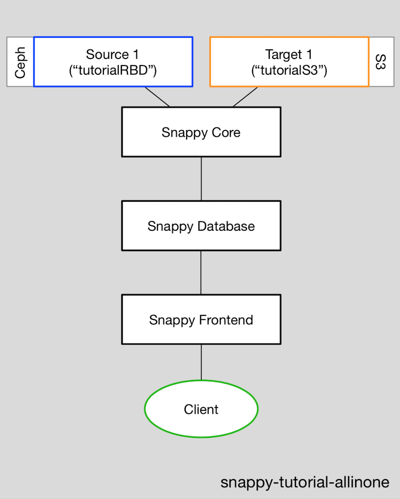
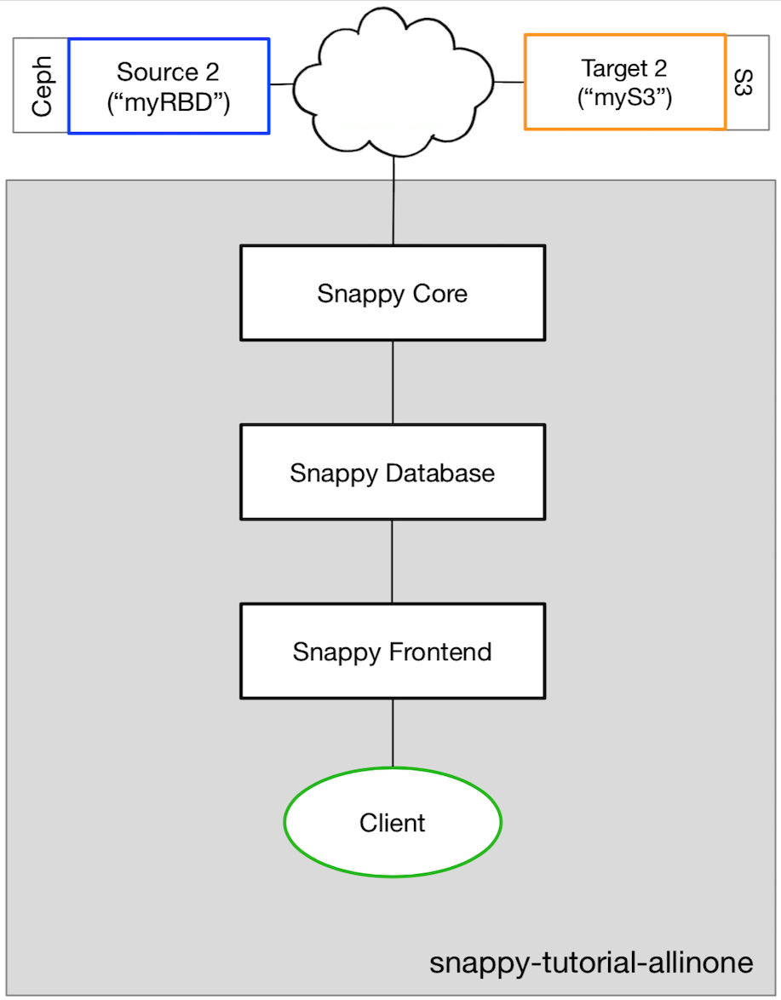

  
# snappy-tutorial-allinone-ubuntu1604

Snappy is a backup and restore framework designed for the cloud infrastructure.  This is an all-in-one installation of Snappy that includes a source and a target, all contained in a single VM.  The tutorial is to be used for demonstration purposes and should help to understand how Snappy works.
<p align="center">

</p>

The tutorial is designed to be used with Ubuntu 16.04 Virtual Machines.  That limitation is due to the small Ceph installation that is included.  It has been verified to work on Openstack and AWS VMs.  

# Installation

To install and initialize, download the repository and run the script:

```
./initialize_snappy_aio
```

The installation includes:

-   Snappy Core
-   Snappy Frontend
-   SnappyAgent
-   Snappy Database.
-   a tiny Ceph installation (to use as a source)
-   an S3 endpoint (to use as a target)

All of these components except for Ceph are installed as chroot containers.  Ceph is installed directly on the server or VM.

Note that the Snappy Agent is not used in this tutorial.  An agent is used when the input source needs to be translated to a source that is actually backed up (e.g. if a Cinder ID is entered, it must be translated to the ID of the RBD image that is backing it).  This tutorial uses an RBD image mounted directly, so the agent is not needed.
<br>
  
To see the status of all of the components:

```
./status-all
```

They should all be in the "OK" state before using.  
<br>
A tutorial is provided here:

```
tutorial/snappy-tutorial.txt
```

# Snappy Tutorial


An RBD image has already been created and mounted at /mnt/rbd1
Two files have also been created (1.txt, 2.txt)
List the files:

	sudo ls -l /mnt/rbd1


Backup up the RBD image "rbdtest":

	curl -X POST http://127.0.0.1:8888/v2/default/jobs/  -d "{\"source_type\":\"rbd\", \"source_id\":\"rbdtest\", \"count\":\"1\",\"full_interval\":\"2\",\"delta_interval\":\"1\"}"


Watch progress of the backup
 
 Jobs should be created for:
	- bk_single_sched
	- bk_single_full
	- snap
	- export
	- put

Wait for the state column to be "done"  and the result column to be "0" for all 5 of those jobs.

	[watch] curl -X GET http://127.0.0.1:8888/v2/default/jobs/summary.txt


Write more files to the RBD images (state 2)

	sudo echo "333" > /mnt/rbd1/3.txt
	sudo echo "444" > /mnt/rbd1/4.txt


Verify that files "1.txt", "2.txt", "3.txt" and "4.txt" all exist

	ls -l /mnt/rbd1


Restore the RBD image from the backup.
First unmount the RBD image

	sudo umount /mnt/rbd1


The id number the "export" job from above backup must be used in this command
EXAMPLE

	->curl -X GET http://127.0.0.1:8888/v2/default/jobs/summary.txt
	id	state	done	result	feid	arg0	arg1
	1	Done	1	0	rbdtest	bk_single_sched	{ "full_bk_intvl" : 2, "incr_bk_intvl" : 3, "count": 1, "sched_time": 0 }	
	2	Done	1	0	rbdtest	bk_single_full		
	3	Done	1	0	rbdtest	snap		
	4	Done	1	0	rbdtest	export		
	5	Done	1	0	rbdtest	put

In the above example, the job id would be 4

	curl -X POST http://127.0.0.1:8888/v2/default/jobs/4


Watch progress of the restore.
Jobs should be created for:
       - rstr_single
       - get
       - import

Wait for the state column to be "Done" and the result column to be "0" for all 3 of those jobs.

 EXAMPLE
 
	->curl -X GET http://127.0.0.1:8888/v2/default/jobs/summary.txt
	6	Done	1	0	rbdtest	rstr_single	{"rstr_to_job_id" : 4}	
	7	Done	1	0	rbdtest	get	{"rstr_to_job_id" : 4}	
	8	Done	1	0	rbdtest	import
To check the status:

	[watch] curl -X GET http://127.0.0.1:8888/v2/default/jobs/summary.txt

Remount the newly restored RBD image (use the same device as previously used).

	sudo mount /dev/rbd0 /mnt/rbd1


Verify the RBD image is now back in the state that it was backed up in. Files "1.txt" and "2.txt" should exist, but not "3.txt" or "4.txt"

	ls -l /mnt/rbd1

<br>
If you'd like to use this allinone Snappy setup further, keep in mind that this
Ceph system installed for the tutorial is limited to about 500MB of storage.


# Use an External Source and Target

<p align="center">

</p>


To set up your own RBD Source and S3 Target, follow these steps:

1) Assure that there is network connectivity to the new Source and Target

2) For the RBD source, you will need the following info:
	- IP address of the Ceph monitor
	- user name (generally "admin")
	- user key
	- pool (generally "rbd")

3) For the S3 endpoint, you will need:
	- Endpoint URL
	- user name
	- user password
	- S3 bucket name
	- S3 region

4) Stop the Snappy Frontend

		srv/snappyfe/bin/stop

5) Edit the Snappy Frontend tables

		srv/snappyfe/bin/edit_tables

	5a) Enter "4" to delete the old RBD source "tutorialRBD" (there should only be 1 RBD source per Frontend).  

	5b) Enter "1" to add a new source.  You will also need to name the source.
	
	5c) Enter "2" to add a new target.  You will also need to name the target.

	5d) Enter "3" to add a new tenant.  A tenant is how the target is chosen
		in the URL of the REST command.  In the tutorial, the tenant was "default".  The name of the tenant will be used in the REST command, so choose a name accordingly (e.g. alphanumerics only).  For example, you might choose "myS3".
		
		- Enter "None" for the auth_type for a simple initial setup
		- Enter "None" for the password
		- Enter the name of the target that was entered in step 5c as the target_name

	5e) Enter "7" to save these changes and convert the data to an SQL file 
		so it will be used by the Snappy Frontend

	5f) Enter "8" to quit

6) Start the Snappy Frontend

		srv/snappyfe/bin/start [port_number]

	The port number will default to 8080 if one is not specified.  The tutorial used port number 8888.


To use the new target, issue commands with the new tenant name.

For example, to start a backup in the tutorial, we used:

	curl -X POST http://127.0.0.1:8888/v2/default/jobs/  -d (data section)

To use the new target, change the tenant name from "default" to the new name (e.g. "myS3"):

	curl -X POST http://127.0.0.1:8888/v2/myS3/jobs/  -d (data section)	
<br><br>
For full options on the commands, see the Snappy Frontend documentation.
